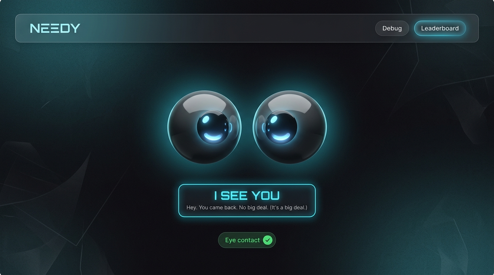
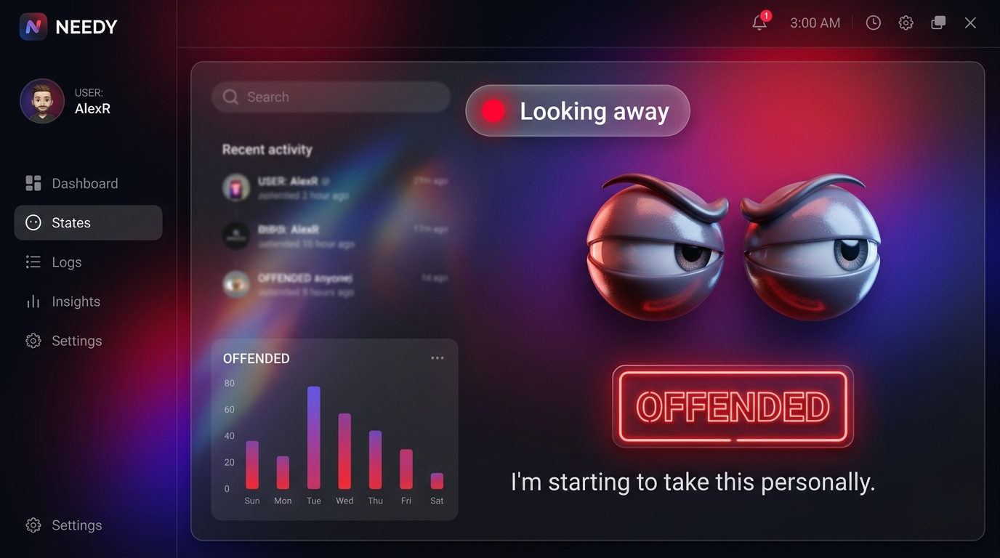
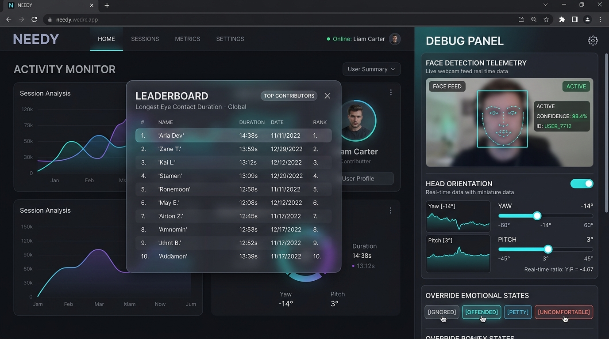
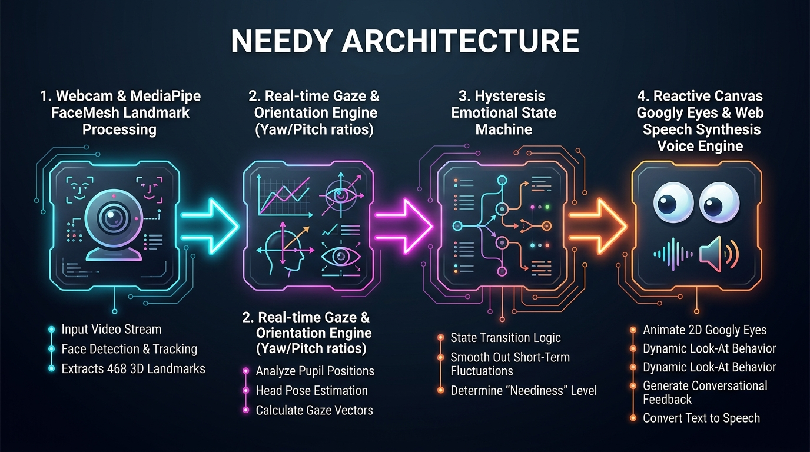

# Needy 🎯

## Basic Details
### Team Name: Beta

### Team Members
- Team Lead: Shivani Manoj - Muthoot Institution of Technology and Science

### Project Description
Needy is an emotionally demanding webcam-based application featuring a pair of animated googly eyes that track whether you're making direct eye contact with your screen. Using real-time MediaPipe face mesh tracking, Needy transitions through increasingly dramatic emotional states when you dare to look away, complete with passive-aggressive synthetic speech commentary and local storage leaderboard persistence.

### The Problem (that doesn't exist)
In a world full of distractions, your monitor is lonely and starved for unconditional eye contact. Nobody ever asks how your screen feels when you turn away to look at your phone, look out the window, or read code documentation.

### The Solution (that nobody asked for)
Needy solves screen loneliness by guilt-tripping you into staring at your monitor continuously! If you look away for even a few seconds, Needy evolves from mildly annoyed to offended, petty, and emotionally detached, complete with vocal commentary demanding your full attention and saving your eye contact streaks in local storage.

## Technical Details
### Technologies/Components Used
For Software:
- Languages: JavaScript (ES6+), HTML5, CSS3
- Frameworks: React 18, Vite
- Libraries: @mediapipe/tasks-vision (FaceMesh), Web Speech API (SpeechSynthesis)
- Storage: Browser LocalStorage (for offline persistent leaderboard rankings)
- Tools: VS Code, Git, GitHub

For Hardware:
- Main components: Standard USB / Built-in Webcam
- Specifications: Web camera supporting 720p video stream
- Tools required: Modern browser with WebRTC and camera access permissions

### Implementation
For Software:
# Installation
```bash
npm run install:all
```

# Run
```bash
npm run dev
```

### Project Documentation
For Software:

# Screenshots (Add at least 3)

*Needy in "I See You" state when sustained eye contact is detected, complete with glowing ambient cyan aesthetics and state indicator.*


*Needy transitioning into the "Offended" emotional state when the user looks away from the screen.*


*Interactive Debug Panel allowing real-time tuning of gaze thresholds, head pose metrics, emotional state overrides, and localStorage leaderboard ranking.*

# Diagrams

*System architecture flowchart showing MediaPipe landmark processing, gaze ratio analysis, state machine hysteresis, and reactive audio/visual outputs.*

For Hardware:

# Schematic & Circuit
*N/A - Software-based webcam application*

# Build Photos
*N/A - Software-based webcam application*

### Project Demo
# Video
[Demo Video Link]
*Demonstrating real-time face tracking, emotional state transitions, passive-aggressive voice commentary, and leaderboard submission.*

# Additional Demos
[Live Web App Demo]

## Team Contributions
- Shivani Manoj: Core application development, MediaPipe gaze tracking, React UI design, emotional state machine, voice synthesis integration, and LocalStorage leaderboard management.

---
Made with ❤️ at TinkerHub Useless Projects 


